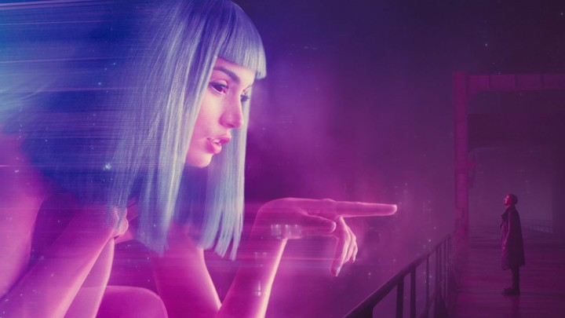

# BladeRunner2049-Animation-Project
This is one of my Projects that I developed for my Animation Assignment during my 1st Year at Waterford Institute of Technology using Java Processing 3 for my Programming Fundamentals I Module. The Java Processing Software can be downloaded [here](https://processing.org/download/). This project was greatly inspired by one of my favourite Science-Fiction Movie called 'BladeRunner 2049' directed by Denis Villeneuve and written by Hampton Fancher and Michael Green. A sequel to the 1982 film Blade Runner.

  Should you have any problems, don't hesitate to contact me on my email at:  [20079462@mail.wit.ie](mailto:20079462@mail.wit.ie)
 or if you find a bug  [open up an issue here](https://github.com/EazyRob97/A-Song-of-Ice-and-Fire-Game-of-Thrones-Route-Finder/issues)

# Don't Forget To Put Your Headphones On And Enjoy The Visual Experience!!
